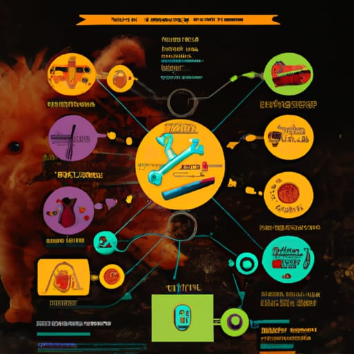

<!DOCTYPE html>
<html>
<head>
<title>Offload thinking</title>
<meta charset="UTF-8">
<style>
html { scroll-behavior: smooth; padding: 0; background: #bbb; }
slide {
  width: calc(100% - 4em); min-height: calc(100vh - 4em);
  padding: 2em 4em;
  margin: 2em;
  background: #ddd; border-radius: 1em;
  box-sizing: border-box; 
  display: flex; flex-direction: column;
}
body { display: flex; flex-direction: column; align-items: center; padding: 0; margin: 0; font-size: 24pt; }
hr { margin: 0; padding: 0; }
h1 { margin: auto; text-align: center; }
h1 > sub { color: #444; font-style: italic; font-size: 0.4em; }
fig { display: flex; flex-direction: row; align-items: center; justify-content: center; flex-grow: 1; }
pre { background: #222; color: #ddd; padding: 0.5em; line-height: 100%; overflow-x: scroll; }
fig > pre { width: fit-content; margin: 0; }
code { background: #222; color: #ddd; border-radius: 0.2em; font-size: smaller; padding: 0 0.2em; }
pre > code { padding: 0; background: transparent; }
li { margin: 0.5em; }
li li { font-size: smaller; }
@media print {
h2 { margin: 0.08em; }
slide { height: calc(100vh - 4em); break-after: page; overflow: hidden; }
slide.reference { font-size: smaller; }
pre { border: solid 1px #ddd; }
fig > pre, fig > code { line-height: normal; font-size: 12pt; }
code { font-size: 16pt; }
p { margin: 0.01em; }
hr { display: none; }
ul { margin-top: 0; margin-bottom: 0; padding-top: 0; padding-bottom: 0; }
li { margin-top: 0; margin-bottom: 0; }
}
</style>
</head>
<body>

<hr tabindex=0 />
<slide>

<h1>Small-Brain Systems Design<br/>
<sub>"just be careful" but better</sub></h1>
<div style="display:flex; justify-content:center; margin:auto;">

<pre style="margin:0; padding:1em;">
<code>    .--.  .-.
  ( internet )  <----
 (    )        ) -->  
  "--"   -----"
</code></pre>
</div>

</slide>
<hr tabindex=0 />
<slide>

## This talk

- Introduction to me and my problems (brainstorming)
- Modelling as a tool for thinking (tool demo)
- Why I don't do this all the time (yet)
- Questions


</slide>
<hr tabindex=0 />
<slide>

## Who am I?

<div style="display:flex; justify-content:space-between;">

- JD but also [shua](https://github.com/shua)
- Worked at Comcast and Joyent, Distributed Systems
- <del>Found</del><ins>Made</ins> a lot of bugs


</div>


</slide>
<hr tabindex=0 />
<slide>

## Problem statement

<fig>

```
data     .-----------.   data (eventually)
------->{ }    q      }------------------>
         "-----------' 
```

</fig>

</slide>
<hr tabindex=0 />
<slide>

## Problem statement

<fig>

```
     .--.  .-.
   ( internet )
  (    )        )
   "--"   -----"
       |   ^ sync request/response
       v   |
   ,---------.         _..-------.._        
   | Ω-STAR  |<------>|'-...___...-'|        
   '---------'        |    OurDB    |        
     |     ^          '-._________.-'
     |     '-------------.
     |    .-----------.  |
     '-->{ }    q      }-' async messaging
          "-----------'  
```

</fig>

</slide>
<hr tabindex=0 />
<slide>

## Problem statement

- CEP and WELP 🤷
- Batch processing state changes
- Requirements: in-order[<sup>1</sup>](#in-order), at-least-once

<fig>

```
ADD 123 Movie{... version 1 ...}
ADD 444 Actor{...}
DEL 444
DEL 123
ADD 123 Movie{... version 2 ...}
```

</fig>

</slide>
<hr tabindex=0 />
<slide>

## Problem statement

- Retries vs in-order
  ```
                retry v1
                 ,------.
   .-------. v2  v,-----X.
  { }  q    }---->| WELP |--->
   "-------'      '------'
  ```

</slide>
<hr tabindex=0 />
<slide>

## Problem statement

- Poison pills and dead-letter-queues
  ```
      .-------. 
   ,>{ } dlq   }
   |  "-------'   v1
   '--------------------.
   .-------. ?    ,-----X.
  { }  q    }---->| WELP |--->
   "-------'      '------'
  ```
- Manual re-ingest vs in-order
- Performance: partial updates, compaction


</slide>
<hr tabindex=0 />
<slide>

## Brainstorming

- in-order, at-least-once
  - `while read msg; do process msg; done`
- manual intervention
  - `curl` with what I think it should be?
- handling errors
  - `retry * max` attempts?

</slide>
<slide>

## My problems

- Please, when building distributed systems, can we do any better than "be careful"?
- Fuzz testing is great...
  - but I don't want to build and deploy everything before we can realize it's broken.
- Can we just build a proof-of-concept, and fuzz-test that?
  - Another word for "proof-of-concept" is "model"...

</slide>
<hr tabindex=0 />
<slide>

## TLA⁺

- [TLA⁺](https://github.com/tlaplus/tlaplus) is a frontend for `tlc`
  - but don't tell llamport I said that
- There's a specification language which some people like?
- [Some companies](http://lamport.azurewebsites.net/tla/industrial-use.html) used it to find some bugs 

</slide>
<hr tabindex=0 />
<slide>

## Demo

```
$ tlc -config Example.cfg Example.tla
```
<small>checking complex rules that match dogs with owners</small>
<div style="display:flex; justify-content:center; align-items:center;">



</div>

<ul style="font-size:0.3em; font-color:#aaa">
<li>https://www.dailymail.co.uk/health/article-1092075/Use-tissue-How-just-sneeze-infect-150-people.html
<li>https://creator.nightcafe.studio/creation/w0z9gQjD59H3ncIXFfMY
<li>https://wallup.net/animals-nature-dog-closeup/
</ul>

</slide>
<hr tabindex=0 />
<slide>

## TLA⁻

- Docs are all over the place
- llamport doesn't want you to think about `tlc` or types
  - but in practice that means rewriting your spec until stars align
- Poor support for floats, strings[<sup>2</sup>](#strings), probability[<sup>3</sup>](#probability), real-time guarantees
- Better than alternatives[<sup>4</sup>](#alternatives)


</slide>
<hr tabindex=0 />
<slide>

## This is my Coca Cola recipe

- WELP did not deploy 🤷 but Comcast got back its investment in me
- Like `borrowck`, or Mufasa 🦁, it lives in you
- There is a whole world of "formal methods" that are all in this vein

</slide>
<hr tabindex=0 />
<slide>

# Questions?

</slide>
<hr tabindex=0 />
<slide class="reference">

## Notes

1. <a id="in-order">we can partition them by type or individual ID</a>
2. <a id="strings">strings are supported, but they're inconvenient to work with</a>
3. <a id="probability">there's some work being done to collect statistics</a>
   also a good [talk](https://www.youtube.com/watch?v=cYenTPD7740&list=PLWLcqZLzY8u8jqzxEa-U_Q3KQhtxUJPpC&index=4) on using these tools
4. <a id="alternatives">The world of formal methods is vast, and each tool excels in its space. TLA⁺ excels in modelling and checking distributed algorithms.</a>
   - SAT/SMT are useful for the yes/no questions, but don't usually tell you sequence of states to get to no

</slide>
<hr tabindex=0 />
<slide class="reference">

## Links

- learntla: https://www.learntla.com/index.html
  - learntla's links: https://www.learntla.com/examples/index.html
- tlaplus/Examples repo: https://github.com/tlaplus/Examples
- TLA⁺ 2022 conference playlist: https://www.youtube.com/watch?v=GEsvGGp0jyQ&list=PLWLcqZLzY8u8jqzxEa-U_Q3KQhtxUJPpC
- official TLA⁺: http://lamport.azurewebsites.net/tla/tla.html

</slide>
<hr tabindex=0 />

</body>
</html>
